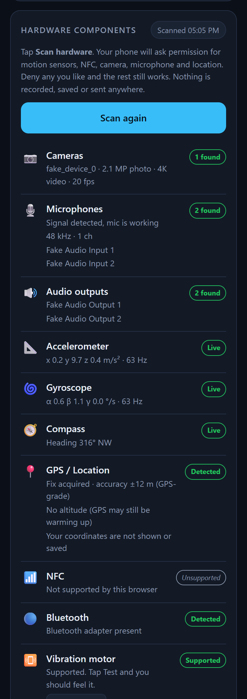

<div align="center">

# ThermoCheck — Phone Temperature Monitoring

**Detect thermal throttling and scan your phone's hardware, right from the browser**
Android & iPhone. No login, no install, no data leaves the phone. Just open and use.

[](https://kymy07.github.io/PhoneTemperatureMonitoring/)
[](https://pages.github.com/)
[]()

### 🔗 **[kymy07.github.io/PhoneTemperatureMonitoring](https://kymy07.github.io/PhoneTemperatureMonitoring/)**

&nbsp;&nbsp;

<sub>Captured in Chrome's Android device emulation with virtual test hardware.</sub>

</div>

---

## Overview

Phones lag during long gaming sessions because they get hot. When the chip heats up,
the system **throttles** it, cutting CPU speed to cool down, and frame rates drop.

ThermoCheck does two things:

1. **Thermal monitor.** It runs a small, fixed CPU workload every few seconds and compares
   it with a baseline recorded while the phone was cool. **100% = full speed.** At 70%
   the phone is throttling, and that's why your game stutters.
2. **Hardware scan.** It reads what the browser can see without asking (model, OS, CPU,
   RAM, GPU, screen, battery, network). It then asks the phone for permission to check
   the cameras, microphones, motion sensors, GPS and NFC, and confirms each one is
   actually working.

It's a static site: plain HTML, CSS and JavaScript with no framework and no build step.

> **Why no °C reading?** Android and iOS don't give websites access to temperature
> sensors. No browser permission exists for them, so only native apps can read them.
> Throttling is the next best signal, and it's the one that causes the lag.

---

## Features

| | |
|---|---|
| 🌡️ **Throttle gauge** | Live % of cool-phone performance, colour-coded Cool / Warm / Hot / Critical |
| 🎯 **Cool calibration** | One tap records a baseline while the phone is cool; stored on the device in `localStorage` |
| 📈 **10-minute history** | Canvas chart with colour zones, so you can see when the phone started heating up |
| 🎮 **FPS & refresh rate** | Measured with `requestAnimationFrame`, snapped to the panel's real Hz (60/90/120/144…) |
| 📱 **Device readout** | Model, OS version, browser, CPU cores & architecture, RAM, GPU name, WebGL/WebGPU, screen, HDR, network, storage |
| 🔐 **Permission-based hardware scan** | Phone prompts for each sensor; deny any and the rest still works |
| 📷 **Cameras** | Every lens: front/back, photo megapixels, max video resolution, fps, flash, zoom |
| 🎙️ **Microphones** | 1-second level check confirms the mic picks up sound; sample rate, channels, inputs & outputs |
| 🧭 **Motion sensors** | Live accelerometer, gyroscope and compass values, with sensor sample rate |
| 📍 **GPS / NFC / Bluetooth** | GPS fix & accuracy (coordinates never shown), NFC chip on/off, Bluetooth adapter |
| 📳 **Vibration, touch, controllers** | Vibration test, multi-touch points, connected game controllers |
| 🔋 **Battery & charging** | Level, time left / time to full, warning when charging (Chrome Android) |
| 🖥️ **System pressure** | OS-reported CPU pressure via the Compute Pressure API, where supported |
| 📲 **Installable PWA** | Add to Home Screen, works offline after the first visit |
| 🔒 **Private** | No login, no analytics, no network calls; nothing is recorded, saved or sent |

---

## How It Works

| Reading | Status | Meaning |
|---|---|---|
| ≥ 90% | 🟢 **Cool** | Full performance |
| 75 – 89% | 🟡 **Warm** | Warming up, still fine |
| 60 – 74% | 🟠 **Hot — Throttling** | CPU is being slowed down; expect lag |
| < 60% | 🔴 **Critical** | Heavy throttling; rest the phone 5–10 minutes |

Each probe is only 250 ms every 3 s, so the monitor itself adds very little heat.
Readings are smoothed with a median of the last three samples. The probe runs in a
Web Worker, so it doesn't distort the FPS reading.

---

## Permissions

The **Scan hardware** button asks for each permission in turn. Every stream is stopped
the moment its reading is taken.

| Component | Prompt | What is read | What is **not** kept |
|---|---|---|---|
| Motion sensors | iOS: *Motion & Orientation*; Android: none | Live accelerometer / gyroscope / compass values | Nothing stored |
| NFC | *Interact with NFC devices* (Android) | Whether the chip exists and is on | No tags are read |
| Camera | *Use your camera* | Lens list, megapixels, video resolution, flash, zoom | No image is captured |
| Microphone | *Use your microphone* | 1 s signal level, sample rate, device list | No audio is recorded |
| Location | *Know your location* | Fix accuracy, altitude availability | Coordinates are never shown or saved |

---

## Browser Support

| Feature | Chrome Android | Safari iOS |
|---|---|---|
| Throttle gauge, chart, FPS | ✅ | ✅ (Safari caps pages at 60 Hz) |
| Phone model | ✅ via Client Hints | ❌ Apple hides the model |
| RAM, CPU architecture | ✅ RAM (rounded) · ⚠️ arch varies | ❌ |
| GPU name | ✅ e.g. *Adreno 740*, *Mali-G715* | ⚠️ generic *Apple GPU* |
| Battery, network | ✅ | ❌ not exposed by iOS |
| Cameras, microphones, GPS | ✅ | ✅ |
| Accelerometer, gyroscope, compass | ✅ | ✅ after permission |
| NFC, Bluetooth, vibration | ✅ | ❌ blocked on iOS |
| Compute Pressure | ⚠️ depends on version | ❌ |
| Screen Wake Lock, install | ✅ | ✅ iOS 16.4+ |

> **Limitation.** A browser pauses background tabs, so ThermoCheck can't sample *while*
> a game is in the foreground. Check before playing, after playing, or between matches.
> Reading the real sensor temperature during gameplay needs a native app.

---

## Tech Stack

**Frontend**: HTML5 · CSS3 (custom properties, grid) · vanilla JavaScript (ES6+)
**Graphics**: inline SVG gauge · Canvas 2D chart
**Web APIs**: Web Workers · User-Agent Client Hints · WebGL / WebGPU · Media Devices & Image Capture ·
Device Motion & Orientation · Geolocation · Web NFC · Web Bluetooth · Gamepad · Vibration ·
Battery Status · Network Information · Compute Pressure · Screen Wake Lock · Service Worker
**Hosting**: GitHub Pages

No npm install, no bundler, no dependencies to audit.

---

## Project Structure

```
PhoneTemperatureMonitoring/
├── index.html              # the whole app: monitor, device readout, hardware scan
├── manifest.webmanifest    # PWA manifest (name, colours, icon)
├── sw.js                   # service worker: offline cache, network-first
├── icon.svg                # app icon / favicon
└── assets/
    ├── preview.png         # README screenshot: thermal gauge
    └── hardware.png        # README screenshot: hardware scan
```

---

## Getting Started

```bash
git clone https://github.com/kymy07/PhoneTemperatureMonitoring.git
cd PhoneTemperatureMonitoring
python -m http.server 8000
```

Then open <http://127.0.0.1:8000/>.

> **Serve over HTTP(S), not `file://`.** Camera, microphone, sensors, GPS, NFC and the
> service worker all require a secure origin (`https://` or `localhost`). To test on a
> phone, open the live GitHub Pages link.

---

## Using It

1. **Once, while the phone is cool** (not gaming, not charging), tap **Calibrate (Cool)**.
2. Tap **Start Monitoring**.
3. Tap **Scan hardware** and allow the permissions you're comfortable with.
4. **After gaming**, open ThermoCheck again. The reading appears immediately.
5. Install it: **Share → Add to Home Screen** (iPhone) or **⋮ → Install app** (Android).

---

## Deployment

GitHub Pages serves the `main` branch from the repository root. Push and the live
site updates on its own, usually within a minute or two.

```bash
git add -A
git commit -m "your message"
git push origin main
```

---

## Editing Guide

<details>
<summary><b>Tuning the probe</b></summary>

The constants at the top of the script in `index.html`:

- `SAMPLE_EVERY_MS`: time between probes (default `3000`)
- `PROBE_MS`: length of each probe (default `250`). Longer is steadier but adds heat.
- `HISTORY_MAX`: points kept on the chart (default `200`, about 10 minutes)

</details>

<details>
<summary><b>Changing the status thresholds</b></summary>

Edit `level(pct)` in `index.html`. It returns the label, colour and hint for each band.
Keep the chart's zone bands in `drawChart()` and the legend in the HTML in sync.

</details>

<details>
<summary><b>Adding a hardware component</b></summary>

1. Add a row to the `COMPONENTS` array: `['key', '🔧', 'Display name']`.
2. Write a `scanX()` function that calls `setComp('key', state, detail)`.
   `state` is one of `ok`, `no`, `denied`, `wait`, `idle`, `na`.
   `detail` is a string or an array of lines, always rendered as text.
3. Call it from the **Scan hardware** click handler. Anything that shows an iOS
   permission prompt must start *before* the first `await`, while the tap still counts
   as a user gesture.

</details>

<details>
<summary><b>Resetting calibration</b></summary>

The baseline lives in `localStorage` under `thermocheck.baseline.v1`. Tap
**Calibrate** again, or clear site data in the browser. Bump the key's version if the
benchmark workload ever changes, because old baselines won't be comparable.

</details>

<details>
<summary><b>Changing the theme</b></summary>

Every colour is a CSS custom property in the `:root` block at the top of `index.html`.
Change them there and the gauge, chart, chips and legend follow.

</details>

<details>
<summary><b>Shipping an update</b></summary>

`sw.js` caches the app shell. After changing files, bump `CACHE` (e.g. `thermocheck-v3`)
so installed copies pick up the new version.

</details>

---

## Contact

[](mailto:adlishah0821@gmail.com)
[](https://www.linkedin.com/in/adlishah-hakimi-56325223a/)
[](https://github.com/kymy07)
[](https://wa.me/60189437671)

---

<div align="center">

**Adlishah Hakimi bin Sharilfuddin** · Malaysia

</div>
