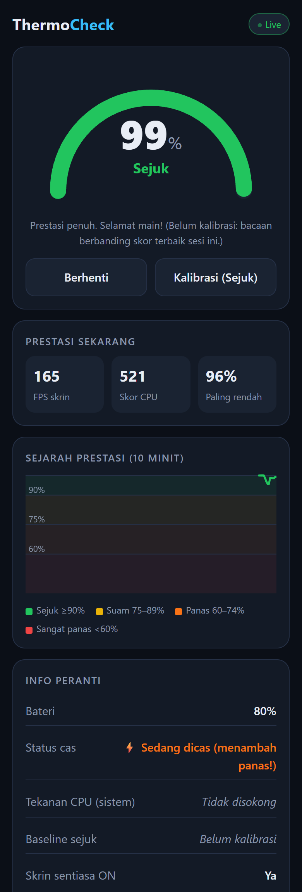

<div align="center">

# ThermoCheck — Phone Temperature Monitoring

**Detect thermal throttling on Android & iPhone, right from the browser**
No login, no install, no data leaves the phone. Just open and use.

[](https://kymy07.github.io/PhoneTemperatureMonitoring/)
[](https://pages.github.com/)
[]()

### 🔗 **[kymy07.github.io/PhoneTemperatureMonitoring](https://kymy07.github.io/PhoneTemperatureMonitoring/)**



</div>

---

## Overview

Phones lag during long gaming sessions because they get hot. When the chip heats up,
the system **throttles** it, cutting CPU speed to cool down, and frame rates drop.

Browsers are **not allowed to read the phone's temperature sensor**. That's true on both
Android and iOS. So ThermoCheck measures the thing that actually causes the lag:
it runs a small, fixed CPU workload every few seconds and compares the result against
a baseline recorded while the phone was cool.

**100% = full speed.** If the score falls to 70%, the phone is throttling, and that's why
your game stutters.

It's a static site: plain HTML, CSS and JavaScript with no framework and no build step.
The interface is in Bahasa Melayu.

---

## Features

| | |
|---|---|
| 🌡️ **Throttle gauge** | Live % of cool-phone performance, colour-coded Sejuk / Suam / Panas / Sangat Panas |
| 🎯 **Cool calibration** | One tap records a baseline while the phone is cool; stored on the device in `localStorage` |
| 📈 **10-minute history** | Canvas chart with colour zones, so you can see when the phone started heating up |
| 🎮 **FPS meter** | Screen refresh rate measured with `requestAnimationFrame` |
| 🧵 **Off-main-thread probe** | CPU benchmark runs in a Web Worker, so it doesn't distort the FPS reading |
| 🔋 **Battery & charging** | Level and charge state, with a warning when charging (Chrome Android) |
| 🖥️ **System pressure** | OS-reported CPU pressure via the Compute Pressure API, where supported |
| ☀️ **Screen stays on** | Screen Wake Lock while monitoring |
| 📲 **Installable PWA** | Add to Home Screen, works offline after the first visit |
| 🔒 **Private** | No login, no analytics, no network calls; everything runs on the phone |

---

## How It Works

| Reading | Status | Meaning |
|---|---|---|
| ≥ 90% | 🟢 **Sejuk** | Full performance |
| 75 – 89% | 🟡 **Suam** | Warming up, still fine |
| 60 – 74% | 🟠 **Panas** | CPU is being throttled; expect lag |
| < 60% | 🔴 **Sangat Panas** | Heavy throttling; rest the phone 5–10 minutes |

Each probe is only 250 ms every 3 s, so the monitor itself adds very little heat.
Readings are smoothed with a median of the last three samples.

---

## Browser Support

| Feature | Chrome Android | Safari iOS |
|---|---|---|
| Throttle gauge, chart, FPS | ✅ | ✅ |
| Calibration saved on device | ✅ | ✅ |
| Battery & charging | ✅ | ❌ not exposed by iOS |
| Compute Pressure | ⚠️ depends on version | ❌ |
| Screen Wake Lock | ✅ | ✅ iOS 16.4+ |
| Install to Home Screen | ✅ | ✅ |

> **Limitation.** A browser pauses background tabs, so ThermoCheck can't sample *while*
> a game is in the foreground. Check before playing, after playing, or between matches.
> Reading the real sensor temperature during gameplay needs a native app.

---

## Tech Stack

**Frontend**: HTML5 · CSS3 (custom properties, grid) · vanilla JavaScript (ES6+)
**Graphics**: inline SVG gauge · Canvas 2D chart
**Web APIs**: Web Workers · Battery Status · Compute Pressure · Screen Wake Lock · Service Worker
**Hosting**: GitHub Pages

No npm install, no bundler, no dependencies to audit.

---

## Project Structure

```
PhoneTemperatureMonitoring/
├── index.html              # the whole app: UI, benchmark worker, chart, sensors
├── manifest.webmanifest    # PWA manifest (name, colours, icon)
├── sw.js                   # service worker: offline cache, network-first
├── icon.svg                # app icon / favicon
└── assets/
    └── preview.png         # README screenshot
```

---

## Getting Started

```bash
git clone https://github.com/kymy07/PhoneTemperatureMonitoring.git
cd PhoneTemperatureMonitoring
python -m http.server 8000
```

Then open <http://127.0.0.1:8000/>.

> **Serve over HTTP, not `file://`.** The service worker and install prompt only work
> from a served origin. To test on a phone, open the live GitHub Pages link. Wake Lock
> and install need HTTPS.

---

## Using It

1. **Once, while the phone is cool** (not gaming, not charging), tap **Kalibrasi (Sejuk)**.
2. Tap **Mula Pantau** to start monitoring.
3. **After gaming**, open ThermoCheck again. The reading appears immediately.
4. Install it: **Share → Add to Home Screen** (iPhone) or **⋮ → Install app** (Android).

---

## Deployment

GitHub Pages serves the `main` branch from the repository root. Push and the live
site updates on its own, usually within a minute or two.

```bash
git add -A
git commit -m "your message"
git push origin main
```

---

## Editing Guide

<details>
<summary><b>Tuning the probe</b></summary>

The constants at the top of the script in `index.html`:

- `SAMPLE_EVERY_MS`: time between probes (default `3000`)
- `PROBE_MS`: length of each probe (default `250`). Longer is steadier but adds heat.
- `HISTORY_MAX`: points kept on the chart (default `200`, about 10 minutes)

</details>

<details>
<summary><b>Changing the status thresholds</b></summary>

Edit `level(pct)` in `index.html`. It returns the label, colour and hint for each band.
Keep the chart's zone bands in `drawChart()` and the legend in the HTML in sync.

</details>

<details>
<summary><b>Resetting calibration</b></summary>

The baseline lives in `localStorage` under `thermocheck.baseline.v1`. Tap
**Kalibrasi** again, or clear site data in the browser. Bump the key's version if the
benchmark workload ever changes, because old baselines won't be comparable.

</details>

<details>
<summary><b>Changing the theme</b></summary>

Every colour is a CSS custom property in the `:root` block at the top of `index.html`.
Change them there and the gauge, chart and legend follow.

</details>

<details>
<summary><b>Shipping an update</b></summary>

`sw.js` caches the app shell. After changing files, bump `CACHE` (e.g. `thermocheck-v2`)
so installed copies pick up the new version.

</details>

---

## Contact

[](mailto:adlishah0821@gmail.com)
[](https://www.linkedin.com/in/adlishah-hakimi-56325223a/)
[](https://github.com/kymy07)
[](https://wa.me/60189437671)

---

<div align="center">

**Adlishah Hakimi bin Sharilfuddin** · Malaysia

</div>
